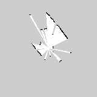

# Pi LiDAR Room Mapper

An interview-ready robotics project for a Raspberry Pi 5, Raspberry Pi Camera Module v2, and Slamtec RPLIDAR A1M8.

The project builds a live 2D occupancy-grid map from LiDAR scans, optionally captures synchronized camera snapshots, and serves a browser dashboard for demos. It is designed to work in three modes:

- `sim`: deterministic synthetic scans for development without hardware.
- `replay`: recorded JSONL scans for repeatable demos and tests.
- `rplidar`: live data from the Slamtec RPLIDAR A1M8 over serial.

## Real Hardware Result

This map was exported from a real RPLIDAR A1M8 recording captured on the Raspberry Pi 5.



## Why This Is Interview-Ready

- Clear sensor abstraction for simulation, replay, and real hardware.
- Occupancy-grid mapping with ray tracing and log-odds updates.
- Live dashboard that can run directly on the Pi.
- Data capture/replay workflow for reproducible debugging.
- Hardware setup, architecture notes, and interview talking points.
- Tests around the math and protocol parsing.

## Case Study

The goal was to turn inexpensive robotics hardware into a reliable mapping demo that can be shown live or replayed without the sensors attached. The project uses a Raspberry Pi 5 as the edge computer, a Slamtec RPLIDAR A1M8 as the range sensor, and an optional Pi Camera v2 for synchronized snapshots.

The system is built around small adapters: simulated scans for development, replayed JSONL scans for reproducible demos, and a serial RPLIDAR driver for live capture. Incoming polar measurements are integrated into a log-odds occupancy grid with ray tracing. The dashboard serves the latest map state over HTTP, `scan-match` estimates relative motion between consecutive scans, and `export-map` writes PNG, PGM, and YAML outputs for portfolio screenshots or ROS-style workflows.

The default mapper assumes the LiDAR is stationary at the map origin, and pose-aware export is available as an opt-in scan-matching mode. Camera frames are timestamped during recording and can be replayed in the dashboard beside the matching LiDAR scan. That keeps the live demo stable while creating a clear path toward full SLAM with pose estimation, scan matching, and sensor fusion.

## Quick Start

```powershell
py -m venv .venv
.\.venv\Scripts\python.exe -m pip install -e ".[dev]"
.\.venv\Scripts\python.exe -m pytest
.\.venv\Scripts\python.exe -m lidar_room_mapper serve --source sim --http-port 8000
```

Then open [http://127.0.0.1:8000](http://127.0.0.1:8000).

On a Raspberry Pi:

```bash
python3 -m venv --system-site-packages .venv
. .venv/bin/activate
python -m pip install -e ".[hardware]"
python -m lidar_room_mapper serve --source rplidar --port /dev/ttyUSB0 --camera
```

## Common Commands

Run the dashboard with simulated scans:

```bash
python -m lidar_room_mapper serve --source sim
```

Run from a replay file:

```bash
python -m lidar_room_mapper serve --source replay --input data/sample_scan.jsonl
```

Replay LiDAR with synchronized camera stills:

```bash
python -m lidar_room_mapper serve --source replay --input captures/session.jsonl --frames captures/session_frames.jsonl --host 0.0.0.0
```

Record live LiDAR scans:

```bash
python -m lidar_room_mapper record --source rplidar --port /dev/ttyUSB0 --output captures/session.jsonl
```

Record LiDAR plus timestamped camera stills:

```bash
python -m lidar_room_mapper record --source rplidar --port /dev/ttyUSB0 --output captures/session.jsonl --camera --camera-every 10
```

Export a replayed map:

```bash
python -m lidar_room_mapper export-map --source replay --input captures/first_room.jsonl --output artifacts/first_room --scans 200
```

For moving-sensor experiments, add `--pose-mode scan-match`.

Estimate relative motion between replayed scans:

```bash
python -m lidar_room_mapper scan-match --source replay --input captures/first_room.jsonl --scans 20
```

Print one integrated map summary:

```bash
python -m lidar_room_mapper scan-once --source sim
```

## Hardware

- Raspberry Pi 5, 8 GB
- Raspberry Pi Camera Module v2
- Slamtec RPLIDAR A1M8
- USB power that can comfortably supply the Pi 5 and peripherals

See [docs/HARDWARE_SETUP.md](docs/HARDWARE_SETUP.md) for wiring, permissions, and first-run checks.

## Recommended Next Steps

1. Commit this baseline so the clean simulator, replay, dashboard, tests, and docs are preserved as v0.
2. Boot the Raspberry Pi, enable SSH, and connect from your laptop. Start with [docs/HARDWARE_SETUP.md](docs/HARDWARE_SETUP.md#first-boot-and-ssh).
3. Bring up the hardware one piece at a time: simulated mapper, camera check, then live RPLIDAR.
4. Record one real room dataset:

```bash
python -m lidar_room_mapper record --source rplidar --port /dev/ttyUSB0 --output captures/first_room.jsonl --limit 200
```

5. Use that replay file for a reliable interview demo, export a static map, then add pose estimation as the next engineering milestone.

## Project Layout

```text
src/lidar_room_mapper/
  cli.py                 Command-line entry points
  models.py              Shared dataclasses
  mapping/occupancy.py   Occupancy-grid mapper
  sensors/               Sim, replay, RPLIDAR, and camera adapters
  dashboard/             Browser dashboard and HTTP server
tests/                   Protocol, replay, and mapping tests
docs/                    Architecture and interview guide
deploy/                  systemd unit for Pi deployment
```

## Sources

The implementation follows the current Raspberry Pi Picamera2 documentation and Slamtec RPLIDAR A-series SDK/protocol references. Links are collected in the hardware setup doc.
