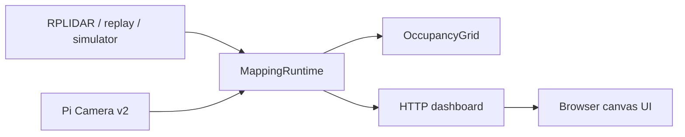

# Architecture

## Runtime Flow

The system is intentionally layered:

- `sensors` exposes common scanner and camera interfaces.
- `mapping` contains deterministic, testable occupancy-grid code.
- `runtime` coordinates background sensor ingestion and snapshot state.
- `dashboard` serves a local browser UI with no frontend build step.
- `cli` wires everything into demo, recording, and validation workflows.

## Mapping Model

The default live mapper assumes the robot is stationary at the center of the map. Each LiDAR measurement is ray traced with Bresenham cells:

- Cells along the ray are nudged toward free space.
- The endpoint is nudged toward occupied space when the distance is inside max range.
- Log odds are clamped to avoid overconfidence.

That tradeoff makes the demo reliable and explainable. The next evolution is pose tracking from wheel odometry, visual odometry, IMU, or scan matching.

## Scan Matching

The `scan-match` command estimates relative motion between consecutive LiDAR scans with a dependency-free correlative search:

- Convert each scan into a bounded 2D point cloud.
- Search small translations and rotations around the prior pose estimate.
- Score each candidate by nearest-neighbor alignment error.
- Prefer zero motion unless a candidate improves the score by a meaningful margin.
- Compose the best relative transform into a cumulative 2D pose.

This is intentionally a first SLAM building block rather than a full loop-closure system. It gives the project a clean place to add better scan matching, odometry, or camera-based pose priors later.

## Why Replay Exists

Hardware demos are fragile in interviews. Replay files give you a deterministic path:

1. Capture a real session on the Pi.
2. Commit a small anonymized recording.
3. Demo the exact same map from any laptop.
4. Use tests to catch parser and mapping regressions.

## Extension Points

- Add robot motion and transform scans into a shared map frame.
- Fuse camera frames with LiDAR timestamps.
- Save maps as PNG/PGM/YAML for ROS or navigation stacks.
- Add scan matching for pose estimation.
- Stream camera frames instead of periodic still captures.

## Map Export

The `export-map` command integrates a bounded number of scans and writes three files:

- `.png`: browser- and README-friendly map image.
- `.pgm`: ROS-style occupancy grid image.
- `.yaml`: map metadata with resolution, origin, and occupancy thresholds.

The exported map uses trinary occupancy values: black for occupied cells, white for free cells, and gray for unknown cells.

For moving-sensor experiments, `export-map --pose-mode scan-match` places each scan using the cumulative scan-matched pose instead of treating every scan as if it came from the map origin.
